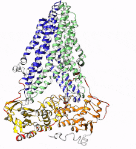

# mrp7pred

A machine learning pipeline to predict putative MRP7 ligands

## Overview



_A dancing MRP7 protein. (MRP7 homology model built in our group)_

MRP7, also named ATP-binding cassette transporter C10 (ABCC10), was first
discovered in 2003 and has been proved to mediate multidrug resistance in
cancer cells.

## Installation

```bash
git clone https://github.com/jingquan-wang/mrp7pred.git
cd mrp7pred
conda env create -f environment.yml
conda activate mrp7pred
pip install -e .
pip install -r requirements.txt
```
